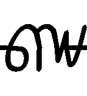
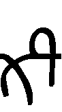
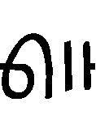

# Distinctive symbol-sequence report

This report treats each cipher line independently, removes encoded whitespace, and counts every contiguous sequence from one through six symbols. Day 16 is retained in the metadata but excluded from sequence statistics because it has no cipher text.

Genre distinctiveness uses passage prevalence rather than raw length: a sequence must occur in at least two passages of the target genre and be at least 10 percentage points more prevalent there. `log2 lift` is a smoothed target-versus-other-genre prevalence ratio.

## Corpus

| lang | passages | passages with symbols |
| --- | ---: | ---: |
| SWC | 14 | 14 |
| Cantonese | 9 | 8 |
| New Poetry | 4 | 4 |
| Classical | 5 | 5 |

## Symbol frequency inventory

Frequencies exclude whitespace and line separators. Images are the current reference templates in `characters/`.

| rank | image | code | occurrences | corpus share | days |
| ---: | --- | --- | ---: | ---: | ---: |
| 1 |  | `0` | 608 | 7.45% | 31 |
| 2 |  | `a` | 504 | 6.18% | 30 |
| 3 |  | `b` | 496 | 6.08% | 31 |
| 4 |  | `1` | 451 | 5.53% | 31 |
| 5 |  | `c` | 448 | 5.49% | 30 |
| 6 |  | `d` | 443 | 5.43% | 30 |
| 7 |  | `e` | 417 | 5.11% | 31 |
| 8 |  | `2` | 387 | 4.74% | 31 |
| 9 |  | `3` | 364 | 4.46% | 30 |
| 10 |  | `4` | 352 | 4.31% | 30 |
| 11 |  | `h` | 303 | 3.71% | 30 |
| 12 |  | `i` | 290 | 3.55% | 31 |
| 13 |  | `j` | 272 | 3.33% | 31 |
| 14 |  | `k` | 252 | 3.09% | 30 |
| 15 |  | `+` | 237 | 2.90% | 31 |
| 16 |  | `l` | 232 | 2.84% | 31 |
| 17 |  | `f` | 215 | 2.63% | 31 |
| 18 |  | `5` | 178 | 2.18% | 30 |
| 19 |  | `m` | 177 | 2.17% | 31 |
| 20 |  | `n` | 176 | 2.16% | 30 |
| 21 |  | `o` | 162 | 1.99% | 30 |
| 22 |  | `p` | 128 | 1.57% | 31 |
| 23 |  | `[` | 120 | 1.47% | 29 |
| 24 |  | `q` | 115 | 1.41% | 28 |
| 25 |  | `r` | 112 | 1.37% | 28 |
| 26 |  | `!` | 107 | 1.31% | 28 |
| 27 |  | `6` | 101 | 1.24% | 30 |
| 28 |  | `s` | 99 | 1.21% | 28 |
| 29 |  | `t` | 87 | 1.07% | 28 |
| 30 |  | `g` | 75 | 0.92% | 26 |
| 31 |  | `]` | 60 | 0.74% | 29 |
| 32 |  | `u` | 44 | 0.54% | 25 |
| 33 |  | `v` | 43 | 0.53% | 22 |
| 34 |  | `7` | 39 | 0.48% | 19 |
| 35 |  | `w` | 39 | 0.48% | 24 |
| 36 |  | `x` | 14 | 0.17% | 7 |
| 37 |  | `8` | 6 | 0.07% | 3 |
| 38 |  | `y` | 4 | 0.05% | 4 |
| 39 |  | `9` | 3 | 0.04% | 3 |
| 40 |  | `z` | 1 | 0.01% | 1 |

## Immediate symbol repetition

A symbol is listed as repeating when its doubled sequence occurs within a source line. ‘Not observed doubled’ is corpus evidence, not proof that the writing system forbids the repetition.

### Observed doubled

| symbol | sequence | occurrences | days |
| --- | --- | ---: | --- |
| `c` | `cc` | 241 | 1, 2, 3, 4, 5, 6, 7, 8, 9, 10, 11, 12, 13, 14, 15, 17, 18, 19, 20, 21, 22, 23, 24, 25, 26, 27, 28, 29, 30, 31 |
| `3` | `33` | 70 | 1, 2, 3, 4, 5, 6, 7, 8, 9, 11, 12, 13, 14, 15, 17, 18, 20, 21, 22, 23, 25, 26, 27, 28, 29, 32 |
| `d` | `dd` | 41 | 4, 5, 7, 9, 11, 13, 15, 17, 18, 21, 22, 23, 25, 27, 29, 30, 31, 32 |
| `b` | `bb` | 39 | 1, 3, 5, 6, 7, 10, 11, 13, 14, 15, 17, 18, 21, 22, 23, 24, 25, 26, 30 |
| `2` | `22` | 31 | 2, 5, 6, 7, 8, 9, 11, 13, 15, 17, 20, 21, 23, 27, 32 |
| `5` | `55` | 31 | 1, 2, 3, 4, 7, 9, 10, 11, 12, 13, 15, 21, 23, 25, 28, 30 |
| `1` | `11` | 19 | 4, 5, 6, 11, 12, 15, 20, 22, 23, 24, 26, 27, 30 |
| `k` | `kk` | 12 | 4, 5, 6, 7, 9, 12, 13, 14, 15, 21 |
| `h` | `hh` | 11 | 3, 4, 12, 17, 19, 20, 21, 29 |
| `4` | `44` | 10 | 5, 6, 9, 17, 18, 26, 29 |
| `r` | `rr` | 7 | 7, 21, 30 |
| `e` | `ee` | 5 | 1, 12, 14, 23, 30 |
| `+` | `++` | 4 | 1, 5, 12, 25 |
| `o` | `oo` | 4 | 1, 6, 10 |
| `f` | `ff` | 3 | 10, 13 |
| `n` | `nn` | 3 | 3 |
| `t` | `tt` | 3 | 1, 20, 25 |
| `j` | `jj` | 2 | 4, 18 |
| `m` | `mm` | 2 | 11 |
| `s` | `ss` | 2 | 15, 24 |
| `6` | `66` | 1 | 1 |
| `u` | `uu` | 1 | 2 |

### Not observed doubled

`!`, `0`, `7`, `8`, `9`, `[`, `]`, `a`, `g`, `i`, `l`, `p`, `q`, `v`, `w`, `x`, `y`, `z`

## Genre-distinctive sequences

### SWC

| n | sequence | target passages | other passages | log2 lift | occurrences |
| ---: | --- | ---: | ---: | ---: | ---: |
| 1 | `7` | 12/14 (86%) | 7/17 (41%) | 1.00 | 24 |
| 1 | `u` | 13/14 (93%) | 12/17 (71%) | 0.37 | 23 |
| 1 | `r` | 14/14 (100%) | 14/17 (82%) | 0.26 | 73 |
| 1 | `q` | 14/14 (100%) | 14/17 (82%) | 0.26 | 66 |
| 1 | `s` | 14/14 (100%) | 14/17 (82%) | 0.26 | 57 |
| 1 | `x` | 4/14 (29%) | 3/17 (18%) | 0.63 | 11 |
| 2 | `q2` | 7/14 (50%) | 0/17 (0%) | 4.17 | 11 |
| 2 | `40` | 13/14 (93%) | 4/17 (24%) | 1.85 | 33 |
| 2 | `j4` | 12/14 (86%) | 4/17 (24%) | 1.74 | 30 |
| 2 | `t1` | 5/14 (36%) | 0/17 (0%) | 3.72 | 12 |
| 2 | `i]` | 5/14 (36%) | 0/17 (0%) | 3.72 | 5 |
| 2 | `0s` | 5/14 (36%) | 0/17 (0%) | 3.72 | 5 |
| 3 | `j40` | 12/14 (86%) | 3/17 (18%) | 2.10 | 26 |
| 3 | `3ak` | 7/14 (50%) | 0/17 (0%) | 4.17 | 7 |
| 3 | `1j4` | 11/14 (79%) | 4/17 (24%) | 1.62 | 25 |
| 3 | `6cc` | 4/14 (29%) | 0/17 (0%) | 3.43 | 6 |
| 3 | `kd2` | 4/14 (29%) | 0/17 (0%) | 3.43 | 5 |
| 3 | `h33` | 4/14 (29%) | 0/17 (0%) | 3.43 | 5 |
| 4 | `1j40` | 11/14 (79%) | 3/17 (18%) | 1.98 | 22 |
| 4 | `ccji` | 4/14 (29%) | 0/17 (0%) | 3.43 | 5 |
| 4 | `cc0k` | 4/14 (29%) | 0/17 (0%) | 3.43 | 5 |
| 4 | `en10` | 6/14 (43%) | 1/17 (6%) | 2.38 | 6 |
| 4 | `gj40` | 4/14 (29%) | 0/17 (0%) | 3.43 | 4 |
| 4 | `esb0` | 4/14 (29%) | 0/17 (0%) | 3.43 | 4 |
| 5 | `0p4bd` | 4/14 (29%) | 0/17 (0%) | 3.43 | 5 |
| 5 | `e6ccc` | 4/14 (29%) | 0/17 (0%) | 3.43 | 4 |
| 5 | `1j402` | 3/14 (21%) | 0/17 (0%) | 3.07 | 5 |
| 5 | `bccji` | 3/14 (21%) | 0/17 (0%) | 3.07 | 4 |
| 5 | `!3ikn` | 3/14 (21%) | 0/17 (0%) | 3.07 | 4 |
| 5 | `j40cc` | 3/14 (21%) | 0/17 (0%) | 3.07 | 3 |
| 6 | `[e6ccc` | 3/14 (21%) | 0/17 (0%) | 3.07 | 3 |
| 6 | `1j40cc` | 3/14 (21%) | 0/17 (0%) | 3.07 | 3 |
| 6 | `0p4bd1` | 3/14 (21%) | 0/17 (0%) | 3.07 | 3 |
| 6 | `0!3ikn` | 3/14 (21%) | 0/17 (0%) | 3.07 | 3 |
| 6 | `kd2013` | 2/14 (14%) | 0/17 (0%) | 2.58 | 3 |
| 6 | `iknroe` | 2/14 (14%) | 0/17 (0%) | 2.58 | 3 |

### Cantonese

| n | sequence | target passages | other passages | log2 lift | occurrences |
| ---: | --- | ---: | ---: | ---: | ---: |
| 1 | `v` | 8/8 (100%) | 14/23 (61%) | 0.64 | 18 |
| 1 | `x` | 3/8 (38%) | 4/23 (17%) | 1.05 | 3 |
| 1 | `s` | 8/8 (100%) | 20/23 (87%) | 0.14 | 31 |
| 1 | `t` | 8/8 (100%) | 20/23 (87%) | 0.14 | 28 |
| 1 | `!` | 8/8 (100%) | 20/23 (87%) | 0.14 | 27 |
| 1 | `w` | 7/8 (88%) | 17/23 (74%) | 0.19 | 10 |
| 2 | `ts` | 4/8 (50%) | 0/23 (0%) | 4.58 | 5 |
| 2 | `0t` | 5/8 (62%) | 1/23 (4%) | 3.29 | 6 |
| 2 | `hl` | 5/8 (62%) | 2/23 (9%) | 2.55 | 8 |
| 2 | `vp` | 5/8 (62%) | 2/23 (9%) | 2.55 | 7 |
| 2 | `di` | 3/8 (38%) | 0/23 (0%) | 4.22 | 5 |
| 2 | `2l` | 8/8 (100%) | 8/23 (35%) | 1.42 | 14 |
| 3 | `sla` | 5/8 (62%) | 0/23 (0%) | 4.87 | 8 |
| 3 | `ab2` | 7/8 (88%) | 3/23 (13%) | 2.51 | 18 |
| 3 | `tsl` | 4/8 (50%) | 0/23 (0%) | 4.58 | 5 |
| 3 | `0ts` | 4/8 (50%) | 0/23 (0%) | 4.58 | 4 |
| 3 | `cab` | 4/8 (50%) | 1/23 (4%) | 3.00 | 7 |
| 3 | `b2l` | 5/8 (62%) | 2/23 (9%) | 2.55 | 6 |
| 4 | `cab2` | 4/8 (50%) | 0/23 (0%) | 4.58 | 7 |
| 4 | `0tsl` | 4/8 (50%) | 0/23 (0%) | 4.58 | 4 |
| 4 | `ccab` | 4/8 (50%) | 1/23 (4%) | 3.00 | 7 |
| 4 | `tsla` | 3/8 (38%) | 0/23 (0%) | 4.22 | 4 |
| 4 | `4k1a` | 4/8 (50%) | 1/23 (4%) | 3.00 | 4 |
| 4 | `3ab2` | 4/8 (50%) | 1/23 (4%) | 3.00 | 4 |
| 5 | `ccab2` | 4/8 (50%) | 0/23 (0%) | 4.58 | 7 |
| 5 | `4be30` | 3/8 (38%) | 0/23 (0%) | 4.22 | 8 |
| 5 | `be30b` | 3/8 (38%) | 0/23 (0%) | 4.22 | 3 |
| 5 | `0tsla` | 3/8 (38%) | 0/23 (0%) | 4.22 | 3 |
| 5 | `!3ab2` | 3/8 (38%) | 0/23 (0%) | 4.22 | 3 |
| 5 | `b4ccj` | 2/8 (25%) | 0/23 (0%) | 3.74 | 3 |
| 6 | `4be30b` | 3/8 (38%) | 0/23 (0%) | 4.22 | 3 |
| 6 | `b4ccj0` | 2/8 (25%) | 0/23 (0%) | 3.74 | 3 |
| 6 | `a2j14b` | 2/8 (25%) | 0/23 (0%) | 3.74 | 3 |
| 6 | `qa2j14` | 2/8 (25%) | 0/23 (0%) | 3.74 | 2 |
| 6 | `j033if` | 2/8 (25%) | 0/23 (0%) | 3.74 | 2 |
| 6 | `giqab2` | 2/8 (25%) | 0/23 (0%) | 3.74 | 2 |

### New Poetry

| n | sequence | target passages | other passages | log2 lift | occurrences |
| ---: | --- | ---: | ---: | ---: | ---: |
| 1 | `w` | 4/4 (100%) | 20/27 (74%) | 0.30 | 6 |
| 1 | `q` | 4/4 (100%) | 24/27 (89%) | 0.04 | 15 |
| 2 | `sw` | 2/4 (50%) | 0/27 (0%) | 4.81 | 2 |
| 2 | `52` | 2/4 (50%) | 0/27 (0%) | 4.81 | 2 |
| 2 | `1m` | 3/4 (75%) | 4/27 (15%) | 2.12 | 3 |
| 2 | `4h` | 3/4 (75%) | 6/27 (22%) | 1.59 | 7 |
| 2 | `!b` | 2/4 (50%) | 1/27 (4%) | 3.22 | 2 |
| 2 | `j4` | 4/4 (100%) | 12/27 (44%) | 1.01 | 10 |
| 3 | `j4h` | 3/4 (75%) | 1/27 (4%) | 3.71 | 5 |
| 3 | `1ef` | 2/4 (50%) | 0/27 (0%) | 4.81 | 3 |
| 3 | `ek!` | 2/4 (50%) | 0/27 (0%) | 4.81 | 2 |
| 3 | `2sw` | 2/4 (50%) | 0/27 (0%) | 4.81 | 2 |
| 3 | `2d1` | 2/4 (50%) | 0/27 (0%) | 4.81 | 2 |
| 3 | `a24` | 3/4 (75%) | 4/27 (15%) | 2.12 | 3 |
| 4 | `1j4h` | 3/4 (75%) | 1/27 (4%) | 3.71 | 5 |
| 4 | `cccc` | 2/4 (50%) | 0/27 (0%) | 4.81 | 4 |
| 4 | `1ef0` | 2/4 (50%) | 0/27 (0%) | 4.81 | 3 |
| 4 | `2d13` | 2/4 (50%) | 0/27 (0%) | 4.81 | 2 |
| 4 | `1022` | 2/4 (50%) | 0/27 (0%) | 4.81 | 2 |
| 4 | `022w` | 2/4 (50%) | 0/27 (0%) | 4.81 | 2 |
| 5 | `ma1j4` | 2/4 (50%) | 0/27 (0%) | 4.81 | 2 |
| 5 | `a1j4h` | 2/4 (50%) | 0/27 (0%) | 4.81 | 2 |
| 5 | `241ip` | 2/4 (50%) | 0/27 (0%) | 4.81 | 2 |
| 5 | `1ip4b` | 2/4 (50%) | 0/27 (0%) | 4.81 | 2 |
| 5 | `1022w` | 2/4 (50%) | 0/27 (0%) | 4.81 | 2 |
| 5 | `022w0` | 2/4 (50%) | 0/27 (0%) | 4.81 | 2 |
| 6 | `ma1j4h` | 2/4 (50%) | 0/27 (0%) | 4.81 | 2 |
| 6 | `ba241i` | 2/4 (50%) | 0/27 (0%) | 4.81 | 2 |
| 6 | `a241ip` | 2/4 (50%) | 0/27 (0%) | 4.81 | 2 |
| 6 | `41ip4b` | 2/4 (50%) | 0/27 (0%) | 4.81 | 2 |
| 6 | `241ip4` | 2/4 (50%) | 0/27 (0%) | 4.81 | 2 |
| 6 | `1022w0` | 2/4 (50%) | 0/27 (0%) | 4.81 | 2 |

### Classical

| n | sequence | target passages | other passages | log2 lift | occurrences |
| ---: | --- | ---: | ---: | ---: | ---: |
| 1 | `7` | 4/5 (80%) | 15/26 (58%) | 0.39 | 12 |
| 2 | `l7` | 3/5 (60%) | 3/26 (12%) | 2.17 | 4 |
| 2 | `et` | 2/5 (40%) | 2/26 (8%) | 2.17 | 4 |
| 2 | `d]` | 2/5 (40%) | 2/26 (8%) | 2.17 | 3 |
| 2 | `1b` | 4/5 (80%) | 9/26 (35%) | 1.09 | 5 |
| 2 | `p7` | 2/5 (40%) | 2/26 (8%) | 2.17 | 2 |
| 2 | `gb` | 2/5 (40%) | 2/26 (8%) | 2.17 | 2 |
| 3 | `ka+` | 2/5 (40%) | 0/26 (0%) | 4.49 | 2 |
| 3 | `j06` | 2/5 (40%) | 0/26 (0%) | 4.49 | 2 |
| 3 | `[et` | 2/5 (40%) | 0/26 (0%) | 4.49 | 2 |
| 3 | `54m` | 2/5 (40%) | 0/26 (0%) | 4.49 | 2 |
| 3 | `1bf` | 4/5 (80%) | 5/26 (19%) | 1.88 | 4 |
| 3 | `ie3` | 2/5 (40%) | 1/26 (4%) | 2.91 | 3 |
| 4 | `i1bf` | 2/5 (40%) | 0/26 (0%) | 4.49 | 2 |
| 4 | `bf0+` | 2/5 (40%) | 0/26 (0%) | 4.49 | 2 |
| 4 | `65l7` | 2/5 (40%) | 0/26 (0%) | 4.49 | 2 |
| 4 | `54mj` | 2/5 (40%) | 0/26 (0%) | 4.49 | 2 |
| 4 | `3b4i` | 2/5 (40%) | 0/26 (0%) | 4.49 | 2 |
| 4 | `33b4` | 2/5 (40%) | 0/26 (0%) | 4.49 | 2 |
| 5 | `i1bf0` | 2/5 (40%) | 0/26 (0%) | 4.49 | 2 |
| 5 | `33b4i` | 2/5 (40%) | 0/26 (0%) | 4.49 | 2 |
| 5 | `1bf0+` | 2/5 (40%) | 0/26 (0%) | 4.49 | 2 |
| 5 | `033b4` | 2/5 (40%) | 0/26 (0%) | 4.49 | 2 |
| 6 | `033b4i` | 2/5 (40%) | 0/26 (0%) | 4.49 | 2 |

## Passage-unique signatures

A signature appears in exactly one passage in the corpus. The list prefers the shortest unique sequences and suppresses longer entries that merely contain an already-listed shorter signature.

| day | lang | key unique sequences (occurrences in that passage) |
| ---: | --- | --- |
| 1 | SWC | `c1` (2), `66` (1), `c4` (1), `o5` (1), `1ea` (2), `1kd` (2), `4hq` (2), `!3+` (1) |
| 2 | New Poetry | `+u` (1), `5q` (1), `6d` (1), `qc` (1), `uu` (1), `+2q` (1), `+da` (1), `1i5` (1) |
| 3 | SWC | `nn` (3), `+w` (1), `7p` (1), `cn` (1), `n]` (1), `nf` (1), `s0` (1), `tf` (1) |
| 4 | Cantonese | `l1` (3), `hu` (2), `ql` (2), `!k` (1), `mf` (1), `nt` (1), `on` (1), `uc` (1) |
| 5 | SWC | `eg` (1), `mr` (1), `qf` (1), `uf` (1), `0os` (2), `11f` (2), `1hd` (2), `f40` (2) |
| 6 | Cantonese | `gq` (1), `ng` (1), `op` (1), `po` (1), `qj` (1), `rg` (1), `ub` (1), `uo` (1) |
| 7 | SWC | `b9` (1), `g6` (1), `jt` (1), `r+` (1), `s!` (1), `t3` (1), `tm` (1), `tq` (1) |
| 8 | Classical | `+l` (1), `1l` (1), `3o` (1), `76` (1), `7b` (1), `7g` (1), `e7` (1), `el` (1) |
| 9 | SWC | `08` (1), `6e` (1), `83` (1), `8[` (1), `fr` (1), `i8` (1), `ls` (1), `np` (1) |
| 10 | New Poetry | `ck` (1), `fi` (1), `fq` (1), `gp` (1), `hw` (1), `nj` (1), `pe` (1), `40f` (2) |
| 11 | Cantonese | `mm` (2), `me` (1), `nm` (1), `r[` (1), `rm` (1), `sd` (1), `2eb` (2), `bbb` (2) |
| 12 | SWC | `c+` (3), `!e` (1), `2u` (1), `3r` (1), `4j` (1), `5f` (1), `63` (1), `7j` (1) |
| 13 | SWC | `0x` (2), `uh` (2), `0h` (1), `6o` (1), `j7` (1), `j9` (1), `mn` (1), `mq` (1) |
| 14 | Classical | `1t` (1), `7u` (1), `ec` (1), `m7` (1), `+4c` (1), `+50` (1), `1id` (1), `1if` (1) |
| 15 | SWC | `z` (1), `31` (1), `ks` (1), `oq` (1), `ul` (1), `w7` (1), `0pd` (2), `0gk` (1) |
| 16 | Cantonese | - |
| 17 | SWC | `45` (1), `5p` (1), `[4` (1), `bx` (1), `oj` (1), `q+` (1), `440` (2), `voi` (2) |
| 18 | Cantonese | `2v` (1), `ew` (1), `gy` (1), `tg` (1), `b50` (3), `jb5` (3), `mjb` (3), `ik6` (2) |
| 19 | New Poetry | `4q` (1), `o+` (1), `ve` (1), `+f1` (2), `f1h` (2), `!i4` (1), `0oc` (1), `2pi` (1) |
| 20 | SWC | `g1` (1), `ix` (1), `t13` (6), `st1` (4), `4bs` (3), `bst` (3), `+t1` (2), `4b+` (2) |
| 21 | SWC | `7q` (1), `v4` (1), `hj1` (3), `ihj` (3), `j10` (3), `02j` (2), `2jd` (2), `ejg` (2) |
| 22 | Cantonese | `1v` (1), `8b` (1), `8h` (1), `[0` (1), `[a` (1), `a8` (1), `d6` (1), `d8` (1) |
| 23 | SWC | `7c` (2), `37` (1), `5[` (1), `g5` (1), `gu` (1), `vb` (1), `bb!` (2), `!3j` (1) |
| 24 | Classical | `7]` (1), `7e` (1), `cm` (1), `g+` (1), `gs` (1), `m1` (1), `om` (1), `pc` (1) |
| 25 | SWC | `ov` (3), `6f` (2), `w6` (2), `+3` (1), `+[` (1), `8e` (1), `[8` (1), `]8` (1) |
| 26 | Cantonese | `23` (1), `6t` (1), `s+` (1), `tu` (1), `v6` (1), `vl` (1), `lo1` (3), `13f` (2) |
| 27 | New Poetry | `i0` (1), `j6` (1), `nu` (1), `!+k` (1), `+20` (1), `+40` (1), `+k0` (1), `011` (1) |
| 28 | SWC | `p5` (2), `ay` (1), `fw` (1), `su` (1), `tx` (1), `yq` (1), `bac` (2), `lhg` (2) |
| 29 | Cantonese | `!5` (1), `6q` (1), `9h` (1), `f9` (1), `of` (1), `t6h` (2), `+h]` (1), `1a[` (1) |
| 30 | Cantonese | `5t` (1), `]o` (1), `fv` (1), `q5` (1), `ri` (1), `55!` (2), `6mj` (2), `ak6` (2) |
| 31 | Classical | `[k` (1), `em` (1), `m]` (1), `!hm` (1), `+4h` (1), `04e` (1), `05k` (1), `1ar` (1) |
| 32 | Classical | `1w` (1), `m2` (1), `054` (1), `1je` (1), `2i+` (1), `5wr` (1), `7+b` (1), `71b` (1) |
